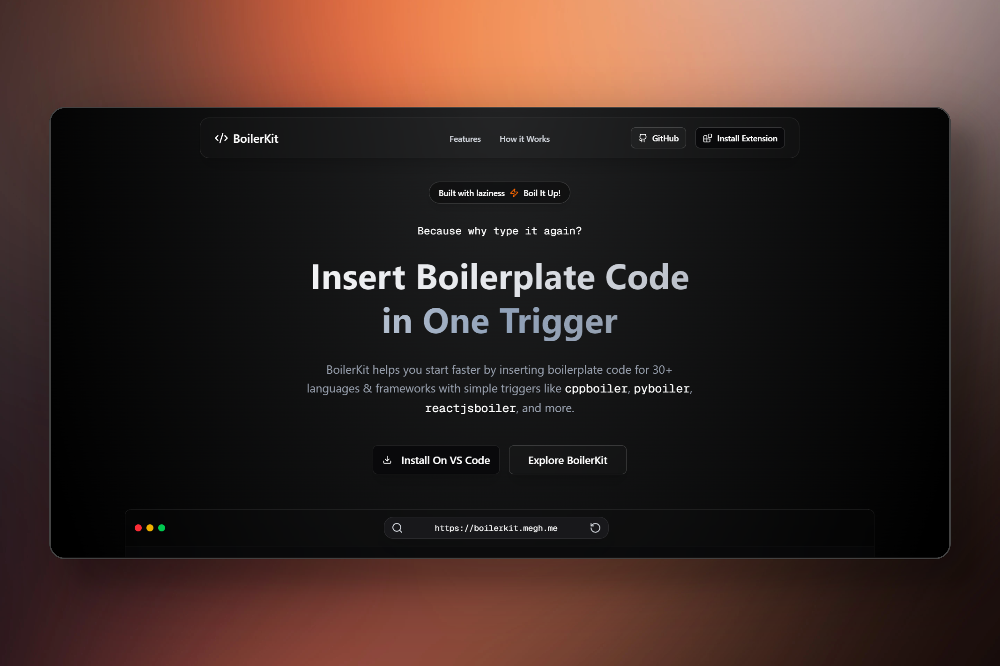
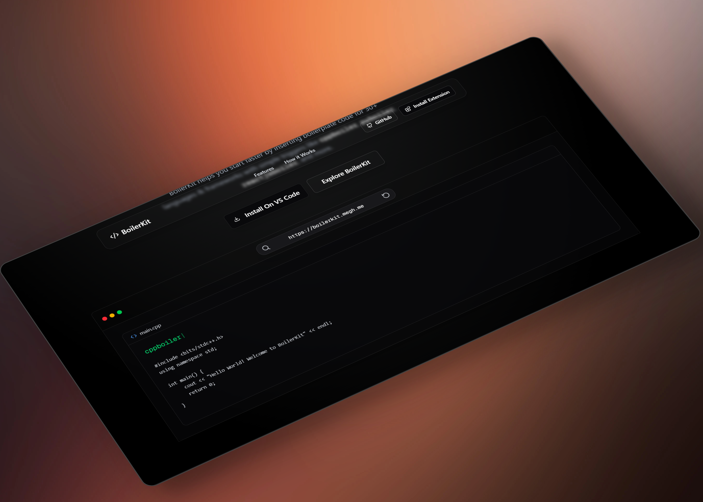

# BoilerKit — VS Code Extension Landing Page

[](https://marketplace.visualstudio.com/items?itemName=megh.BoilerKit)
[](https://marketplace.visualstudio.com/items?itemName=megh.BoilerKit)

This is the official landing page for **[BoilerKit](https://marketplace.visualstudio.com/items?itemName=megh.BoilerKit)**, a Visual Studio Code extension that helps you insert boilerplate code for 30+ programming languages and frameworks instantly.

Built with speed, clarity, and dev productivity in mind.

---

## What is BoilerKit?





BoilerKit is a lightweight, no-setup VS Code extension that lets you quickly scaffold files by typing simple triggers like:

```txt
cppboiler → for C++
pyboiler → for Python
reactjsboiler → for React JSX

```

You get instant code snippets for 30+ languages & frameworks — perfect for devs, students, and competitive programmers.

---

## 📦 Related Repositories

- **[BoilerKit Extension Code](https://github.com/megh-bari/boilerkit)**

- **[Live Demo](https://boilerkit.megh.me)**

## Contributing to BoilerKit

We love community contributions and welcome your help to expand the snippet library or improve the extension!

- **[Contribute Guide](https://github.com/megh-bari/boilerkit?tab=readme-ov-file#Contributing)**

> > **try BoilerKit in VS Code today!**
